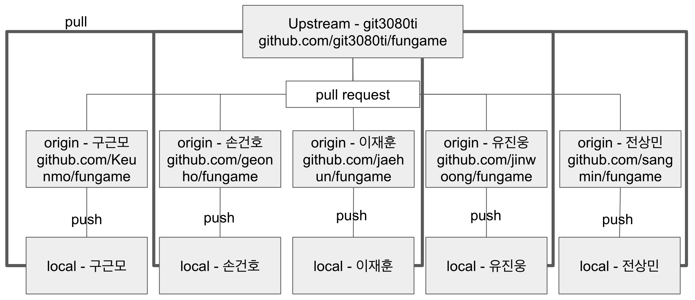
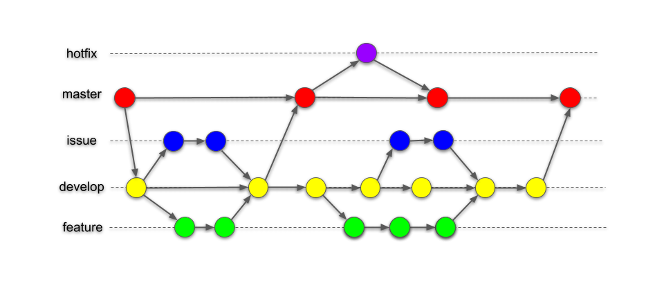
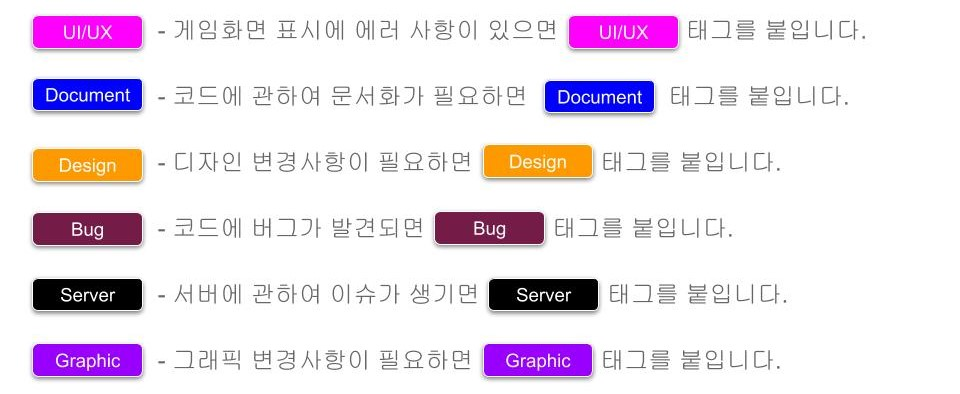

# Git3080ti's Workflow

## 도식화 - Repository

## Repository 운영

1. 저장소는 팀의 upstream repository, upstream을 fork한 팀원의 origin repository, 팀원의 local repository로 구성.
2. 팀원은 local repository에서 개발을 해서 자신의 origin repository로 push를 한다.
3. github에서 자신의 origin repository를 upstream으로 pull request를 보낸다.
4. 코드리뷰를 거친 후 pr을 merge한다.
5. 팀원은 개발 중 upstream을 수시로 pull한다.
6. 같은 내용에 대해서 서로 다른 두개의 pr이 들어올 경우, 팀 회의를 통해 더 적합한 pr을 선택해서 merge한다.
7. pr의 자동 merge가 불가능할 경우(conflict가 난 경우), 해당 pr을 보낸 팀원이 upstream을 pull 한 후, 자신의 origin 레포에 force push를 통해 pr을 수정한다.

## Git 운영

1. self merge 는 불가. 팀원 모두에게 lgtm 을 받으면 merge.
2. git action 을 통해 통과가 되어야 함.
3. 팀원 모두가 push, merge 권한을 갖고있음.
4. 원본 저장소에서 fork하여 upstream에 PR을 날린다.

## Branch

### 도식화 - Branch 

### Main

- 최종적으로 Stable 버전이 반영되는, Release 가 가능한 Main 브랜치입니다.
- Release 이력을 관리하기 위해 사용하므로 **배포 가능한 상태만**을 관리합니다.

### Develop

- issue 나 features 브랜치의 구현이 완료되었을 때 종합하는 브랜치입니다.
- 또한, 간단한 코드 개선이나 issue 발행을 필요로 하지 않는 작업들이 이뤄집니다.
- 성능이 개선되고 기능이 정상 작동하면 main 브랜치에 merge합니다.

### Issue

- 베타 버전(develop branch)에서 이슈가 보고되었을 경우, 해당하는 issue 번호를 붙여 **issue** 브랜치를 만듭니다. base branch 는 develop branch 입니다.
- 이 브랜치는 동시에 몇 가지 이슈를 해결하는지에 따라 여러 개 생성될 수 있습니다.
- 해당 이슈가 해결되면 develop 브랜치에 merge 합니다.
- develop 브랜치에 merge 된 **issue** 브랜치는 삭제합니다.

### Feature

- 새로운 기능을 추가하고 싶을 경우, 그 기능에 대한 **feature** 브랜치를 만듭니다. base branch 는 develop branch 입니다.
- 이 브랜치는 동시에 몇 가지 기능을 개발하는지에 따라 여러 개 생성될 수 있습니다.
- 해당 기능의 구현이 완료되면 develop 브랜치에 merge합니다.
- develop 브랜치에 merge 된 **feature** 브랜치는 삭제합니다.

### Hotfix

- stable release(main) 에 버그 등 **긴급한 이슈**가 보고되었을 경우, main 브랜치를 base branch로 해서 **hotfix** 브랜치를 만듭니다.
- 해당 문제가 해결되면 main branch에 merge 합니다.
  merge된 **hotfix** 브랜치는 삭제합니다.

### ISSUE Tags

